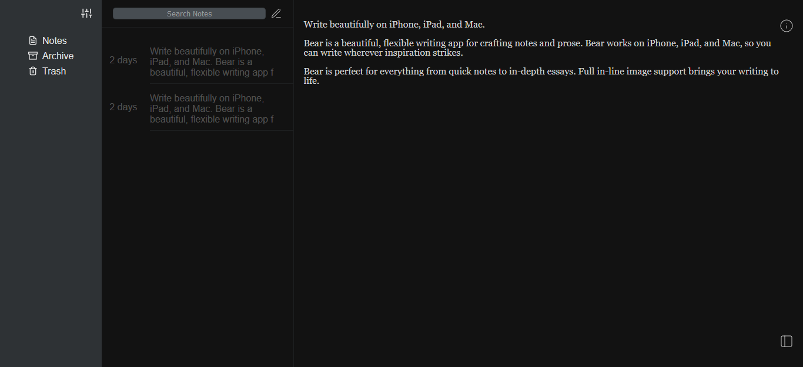

# Bear clone

Bear is perfect for everything from quick notes to in-depth essays.
Full in-line image support brings your writing to life.
This app uses Redux for state management and local storage to save data"

Visit [bear-clone](http://bear-clone.surge.sh/)

## License

This project is licensed under the MIT License - see the [LICENSE](LICENSE) file for details.
